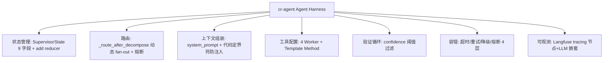

# Agent Harness 评估框架

> 把 2026 年大火的 "Harness Engineering" 概念体系搬到自己项目上，用 7 组件架构把实践从"会用 LangChain"提升到"能讲清楚 Agent 工程"。

## 一、背景（为什么要做这个）

2026 年初 Mitchell Hashimoto（HashiCorp 创始人）写了 "Engineer the Harness"——OpenAI 发百万行代码实验报告、LangChain 出 "The Anatomy of an Agent Harness"、Martin Fowler 跟分析。这个概念一夜之间成了热度。

但追热点不是动机。回头看 cr-agent 37 个子任务分布在 15 个 Phase——graph 状态管理、容错、tracing、评测……这些都是 Harness，但之前散落在各 Phase 没有统一概念框架。做 Phase 15 时，目标是：**用一个概念体系把这些实践串起来**，实践中不是"我做了 15 个 Phase"，而是"我按 Agent Harness 7 组件架构落地了一个完整项目"。

## 二、逐个讲：问题 → 怎么想 → 怎么解

### 2.1 概念梳理：Agent 和 Harness 的关系

**问题**：业界对 Harness 有两种视角，讲不清楚就是概念混淆。

**怎么想**：LangChain 视角——Agent = Model + Harness，Harness 在 Agent 内部（你从零构建 Agent 时搭模型周围的一切）。OpenAI/Hashimoto 视角——Agent 是完整实体，Harness 在 Agent 外部（你用现成 Agent 产品，工程化其运行环境：AGENTS.md、Lint、沙箱）。

**怎么解**：两种视角不矛盾，只是抽象层不同。**核心共识：Harness 是所有让 LLM 可靠工作的非模型推理部分**。cr-agent 是 LangChain 视角的实践——从零构建代码审查 Agent，Harness 自然就是 Agent 内部的基础设施。

### 2.2 7 组件对应 cr-agent 代码

**问题**：概念理解了，但跟自己的代码对应不上就白学。

**怎么想**：把 7 个组件一一对到实际代码。每个组件都要有文件名、类名、函数名佐证——不能停留在"大概有这个"。

**怎么解**：状态管理 → SupervisorState 9 字段 + add reducer；路由 → _route_after_decompose 动态 fan-out + 熔断；上下文组装 → system_prompt + 代码定界符防注入；工具配置 → 4 Worker + Template Method + __init_subclass__；验证循环 → confidence 阈值过滤 + split_by_confidence；容错 → 4 层（超时/重试/降级/熔断）；可观测 → Langfuse tracing 3 Task。

### 2.3 提取核心原则

**问题**：要的不是组件对应表，是"你学到了什么工程原则"。

**怎么想**：从实践抽象 6 条原则，每条有正反面案例。用"确定性约束 > 概率约束"串起所有实践。

**怎么解**：① observability 可靠度 > 业务可靠度（三层降级）② 确定性约束 > 概率约束（代码约束比 prompt 约束可靠）③ 短路优先（能用代码就不用 LLM）④ 分层容错（单点失败不阻塞整体）⑤ 接口稳定实现可变（Tracer 接口多 backend）⑥ 分步递进（tracing 分 3 步每步有价值）。

## 三、关键决策与取舍

| 决策 | 选择 | 取舍 |
|------|------|------|
| Harness 视角 | LangChain 视角（内部） | 匹配从零构建 vs 一个可能的问题是 OpenAI |
| 组件数 | 7 组件 + 评测体系 | 更完整 vs 偏离"参考答案"风险 |
| 原则提炼 | 6 条 + 正反面案例 | 深度 vs 广度（不能覆盖所有） |
| 素材 | STAR 故事 + 量化 + 话术 | 实用 vs 笔记完整性牺牲 |
| 八股 Q&A | 10 问但改配踩坑故事 | 展示判断力 vs 背诵感 |

## 四、踩坑（值得讲的故事）

**评测体系不在标准组件里**。Hashimoto 的 7 组件没有"评测"，LangChain 的文章也没提。但 cr-agent 有完整评测体系（26 样本 + rule_based + LLM-as-Judge + scan_threshold）。一开始很纠结要不要放——放了怕说"这不是标准组件"，不放又可惜。最后决定放进去但要主动标注"额外进阶亮点"。实践中可以主动提："我们认为评测是 Harness 的质量门——没有评测都不知道 Harness 有没有用。"

**两种视角的冲突最容易被追问**。第一次试讲时角色问"LangChain 和 OpenAI 到底哪个对？"一开始想回避——后来想通：这个问题不是要正确答案，是**考察有没有深入思考过 Agent 的定义边界**。能讲清楚区别 + 给出自己的判断（"我认为 LangChain 视角更适用于从零构建的场景"）就够了。

**八股到踩坑故事的转化**。Phase 15 写了 10 道 Q&A 八股，但复盘时发现一个问题——纯八股只能展示"知道不知道"，不能展示工程判断力。比如"怎么做容错？"参考答案是"超时 + 重试 + 降级 + 熔断"，但真正想看的是：**你踩过哪个坑？你怎么判断该不该重试？超时了重试还是降级？** 所以最后素材改成了每组件配一个踩坑故事，不是纯话术背诵。

## 五、常见疑问

**Q: Harness Engineering 的本质是什么？**
A: 传统软件工程在 AI 时代的重新包装。类型系统 → 工具可见性控制，单元测试 → 评测体系，监控告警 → tracing + metrics，权限系统 → 工具不注册。Harness 不是新概念，但让 AI 工程师意识到 Agent 不能只靠 prompt。

**Q: cr-agent 的 Harness 有什么独特之处？**
A: 两个点。① 我们有完整的评测体系（标准 7 组件没有），Harness 的质量门。② 容错做了分层设计——每层不同兜底（LLM 层重试，Worker 层降级，Graph 层熔断），对应分布式系统 bulkhead 模式。

**Q: 防注入方案的局限？**
A: 当前是概率性约束——定界符 + 声明，不是 100%。真正的确定性约束在代码层：工具不注册（Worker 不暴露危险操作能力）、输出解析失败降级。Prompt 层是最后一道防线。

**Q: Agent Harness 跟之前说的"分层职责"是什么关系？**
A: Harness 的核心思想就是分层职责的体现。状态管理、路由、上下文组装、验证、容错、可观测——每一层解决 Agent 的一个"不可靠维度"，每层各自为政不越界。

**Q: 15 个 Phase 做 Harness，你觉得哪一步价值最大？**

---

## 相关笔记

- [[01-技术研读/00-17条架构决策总览|00 17条架构决策总览]]
- [[01-技术研读/09-LLM评测体系搭建|09 LLM评测体系搭建]]
- [[15_多模型后端支持|15 多模型后端支持]]

## 技术学习笔记

- [[39-Agent评测体系：benchmark-case-指标设计|Agent评测体系]]
- [[10-RAG 评估：检索指标 + 生成指标|RAG评估]]
- Agent韧性工程概述
- [[24-Human-in-the-loop：人工介入兜底与敏感操作审批机制|Human-in-the-loop]]
- [[26-工具幂等性与副作用控制：防止重复执行的工程手段|工具幂等性]]
A: 容错和 tracing。容错让 Agent 从"一坏就崩"变成"局部失败不影响整体"——这是生产可用的底线。tracing 让 Agent 从黑盒变成半透明——没 tracing 时 debug 靠猜，有 tracing 靠数据。

## 速记卡（面试闪卡）

**Q1：一句话讲清「Agent Harness 评估框架」到底是什么？**
A：2026 年初 Mitchell Hashimoto（HashiCorp 创始人）写了 "Engineer the Harness"——OpenAI 发百万行代码实验报告、LangChain 出 "The Anatomy of an Agent Harness"、Martin Fowler 跟分析。这个概念一夜之间成了热度。
但追热点不是动机。

**Q2：一、背景（为什么要做这个） —— 怎么理解？**
A：2026 年初 Mitchell Hashimoto（HashiCorp 创始人）写了 "Engineer the Harness"——OpenAI 发百万行代码实验报告、LangChain 出 "The Anatomy of an Agent Harness"、Martin Fowler 跟分析。这个概念一夜之间成了热度。
但追热点不是动机。

**Q3：二、逐个讲：问题 → 怎么想 → 怎么解 —— 怎么理解？**
A：**问题**：业界对 Harness 有两种视角，讲不清楚就是概念混淆。
**怎么想**：LangChain 视角——Agent = Model + Harness，Harness 在 Agent 内部（你从零构建 Agent 时搭模型周围的一切）。OpenAI/Hashimoto 视角——Agent 是完整实体，Harness 在 Agent 外部（你用现成 Agent 产品，工程化其运行环境：AGENTS.md、Lint、沙箱）。

**Q4：三、关键决策与取舍 —— 怎么理解？**
A：| 决策 | 选择 | 取舍 |
|------|------|------|
| Harness 视角 | LangChain 视角（内部） | 匹配从零构建 vs 一个可能的问题是 OpenAI |
| 组件数 | 7 组件 + 评测体系 | 更完整 vs 偏离"参考答案"风险 |
| 原则提炼 | 6 条 + 正反面案例 | 深度 vs 广度（不能覆盖所有） |

**Q5：四、踩坑（值得讲的故事） —— 怎么理解？**
A：**评测体系不在标准组件里**。Hashimoto 的 7 组件没有"评测"，LangChain 的文章也没提。但 cr-agent 有完整评测体系（26 样本 + rule_based + LLM-as-Judge + scan_threshold）。一开始很纠结要不要放——放了怕说"这不是标准组件"，不放又可惜。最后决定放进去但要主动标注"额外进阶亮点"。

**Q6：核心速记主线有哪些？**
A：抓住这几根：一、背景（为什么要做这个）、二、逐个讲：问题 → 怎么想 → 怎么解、三、关键决策与取舍、四、踩坑（值得讲的故事）、五、常见疑问、相关笔记。

