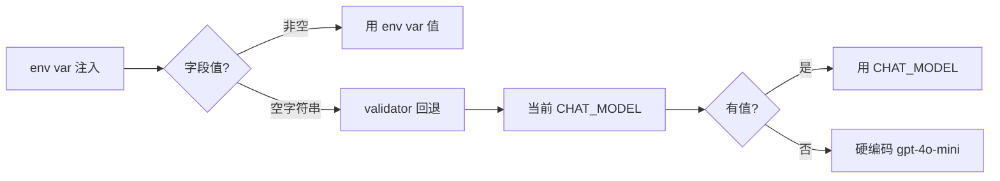
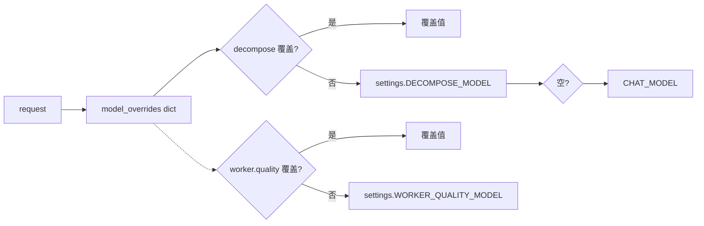

# 多模型后端支持

> 从"一个模型走到底"到"每个角色用最适合的模型"——给 Agent 装了一个配电箱，Decompose 用便宜的、Judge 用最强的，per-request 还能临时覆盖。

## 一、背景（为什么要做这个）

用户需求很直接：Decompose 拆解任务能不能用 DeepSeek（便宜省钱），Quality Worker 能不能用 GPT-4o（审查能力强），Judge 能不能用 Claude Sonnet（评判更准）。每个角色对模型能力的需求不同——简单任务用强模型是浪费，关键任务用弱模型是不够力。

但架构把所有 LLM 调用都硬编码为 `settings.CHAT_MODEL`，一个模型走到底。要改得动 3 层：① config 层加 6 个角色的独立字段 ② schema 层允许 per-request 覆盖 ③ 6 个 LLM 调用点从硬编码改成动态读取。动一发牵全身。

## 二、逐个讲：问题 → 怎么想 → 怎么解

### 2.1 配置与 Schema（做 Task 16.1 时）

**问题**：Pydantic Settings 在类定义时求值。`DECOMPOSE_MODEL: str = CHAT_MODEL` 会在类级别把 CHAT_MODEL 当前值（"gpt-4o-mini"）硬拷贝给 DECOMPOSE_MODEL。之后 env 覆盖 `CHAT_MODEL="deepseek-chat"` 时，DECOMPOSE_MODEL 不会联动——还是"gpt-4o-mini"。

**怎么想**：不用编译期绑定，用运行时回退。空字符串做默认值 + `model_validator(mode='after')` 在实例化后（env 注入完成后）检测空值并回退。三层优先级自然实现：env var 最高 > 空触发 validator > 未配置走默认值。

**怎么解**：6 个字段 `= ""`，model_validator 遍历字段列表，空则 `setattr(self, fld, self.CHAT_MODEL)`。Schema 层 `model_overrides: dict[str, str] | None` + key 校验 validator（只允许 6 个预定义 key，无效抛 ValueError → FastAPI 422）。

**踩坑**：`pydantic-settings` + env 前缀的拼写一致性问题。6 个字段的 env var 自动映射为 `CR_AGENT_DECOMPOSE_MODEL`、`CR_AGENT_WORKER_QUALITY_MODEL` 等。但 validator 里如果忘记处理某个字段，测试会挂。13 个测试每个字段都覆盖到了。

### 2.2 角色级模型路由（做 Task 16.2 时）

**问题**：6 个字段定义好了，但 decompose / 4 Worker / judge 还读 `settings.CHAT_MODEL`。

**怎么想**：核心原则——llm.py 的 AsyncOpenAI 单例不改，所有模型共用同一 client 传不同 model 名（同一 API 平台）。`_resolve_model` 封装三层优先级：per-request > 角色配置 > 全局兜底。

**怎么解**：`_resolve_model(self, model=None)`——优先显式传入值，其次 `getattr(settings, f"WORKER_{self.role.upper()}_MODEL")` 按角色读，最后兜底 CHAT_MODEL。关键用 getattr + 字符串拼接一行搞定 4 个 Worker，不用 if-elif。新增 Worker 模型的角色，路由自动适配——开闭原则。

**踩坑**：decompose 没接 tracing span。我做 Task 14.3 时只给 Worker 节点加了 tracing，decompose_node 的 LLM 调用直接在 decompose.py 里调 client，没有 span 包裹。如果加了 tracing，Langfuse 里能看到 decompose 用了什么模型。但 decompose 只有一次 LLM 调用，优先级不高。

### 2.3 API 透传 + 测试（做 Task 16.3-16.4 时）

**问题**：Schema 定义和调用点改造就位了，但 API 收到 `model_overrides` 后没传到 graph state。

**怎么解**：4 个端点在构建 `initial_state` 时做 `if model_overrides: state["model_overrides"] = model_overrides`。空 dict 不注入——跟节点侧 `state.get("model_overrides", {}).get(...)` 一致，state 里没有 key 等同于空 dict。

测试分层覆盖：config 层 13 个（默认值 / env 覆盖 / key 校验 / 不回归），Worker 层 3 个（`_resolve_model` 默认 + 显式 + 透传），API 层 3 个（同步/流式 + model_overrides + 无效 key 422）。全量 96 passed。

## 三、关键决策与取舍

| 决策 | 选择 | 取舍 |
|------|------|------|
| 默认值策略 | 空字符串 + model_validator | 运行时动态回退 vs 编译期绑定简单但错误 |
| 6 个字段 vs 统一 dict | 6 个独立字段 | env var 友好 + 类型安全 vs 字段数膨胀 |
| key 命名 | "worker.quality" 点分隔 | 层级清晰 vs 代码拼接稍复杂 |
| client 复用 | 一个 client 传不同 model | 连接池复用 vs 多平台时不灵活 |
| model 路由 | getattr + 字符串拼接 | 开闭原则（新增角色不改代码）vs 无类型检查 |
| per-request 注入 | 空 dict 不注入 state | 避免无效 key vs 额外判断 |
| trace model 字段 | 从硬编码改为实际使用 model | 准确 vs 旧 trace 看不到历史 |

## 四、踩坑（值得讲的故事）

**pydantic-settings 默认值绑定时机最隐蔽**。`DECOMPOSE_MODEL: str = CHAT_MODEL` 看起来对，但 Python 类属性在定义时求值——CHAT_MODEL 的值 "gpt-4o-mini" 被硬拷贝到 DECOMPOSE_MODEL。之后 env 覆盖 CHAT_MODEL 为 "deepseek-chat"，DECOMPOSE_MODEL 纹丝不动。跑测试才发现 decompose 没跟全局 CHAT_MODEL 走。改成空字符串 + model_validator——validator 在实例化后运行，此时所有 env 已注入。

**tracing model 字段被动发现需要更新**。改 `_resolve_model` 后发现 tracing metadata 的 model 字段还硬编码 `settings.CHAT_MODEL`——如果用户 per-request 传了不同模型，trace 里看不到真实 model。这不是 bug，但会误导调试。好的设计会"推动"相关代码跟进——不改 tracing 的话，Langfuse 展示的模型永远是全局配置，per-request 覆盖的效果不可见。

**SSE 预存测试时序问题持续**。`test_stream_has_node_events` 从做 Phase 14 时就在失败（astream_events → astream 重写后的时序遗留），到 Phase 16 时还是唯一失败。这不是多模型功能的回归，但说明**团队（其实就一个人）容忍了已知失败的测试在持续**——应该 mark xfail。

## 五、常见疑问

**Q: 为什么不在 Worker 里写死 model 名？**
A: 两个场景需要动态路由。1) 运维通过 env 配不同模型（不同环境不同策略）。2) 用户通过 API 临时覆盖（这个请求想用更强模型跑）。写死在代码里，这两个场景都做不了。

**Q: 如果以后要接入不同平台（decompose 用 OpenAI，Worker 用 DeepSeek）？**
A: 当前 client 复用假设同一平台。跨平台需要拆 client——llm.py 加 `get_chat_client_by_platform(base_url, api_key)`。但这是架构进化，不是当前 MVP。schema 和 config 已经预留了扩展点——`model_overrides` 的值可以是任意字符串，不限制平台。

**Q: model_overrides 的 key 为什么是 "worker.quality" 不是 "worker_quality"？**

---

## 相关笔记

- [[01-技术研读/00-17条架构决策总览|00 17条架构决策总览]]
- [[01-技术研读/01-Supervisor-Worker编排与StateGraph|01 Supervisor-Worker编排与StateGraph]]
- [[01-技术研读/09-LLM评测体系搭建|09 LLM评测体系搭建]]

## 技术学习笔记

- [[15-Agent架构与工具调用|Agent架构与工具调用]]
- [[02-LLM本质-API调用封装|LLM本质-API调用封装]]
- [[03-多模型后端抽象|多模型后端抽象]]
- [[01-Token计费原理-Temperature控制-SystemPrompt层级|Token计费原理]]
- [[27-指数退避重试：Exponential Backoff + Jitter|指数退避重试]]
A: 分层命名——"worker" 是节点类型，"quality" 是子角色。`.` 分隔可以区分 judge、decompose 等其他角色类型。虽然拼接时多了个点，但语义更清晰。

## 速记卡（面试闪卡）

**Q1：一句话讲清「多模型后端支持」到底是什么？**
A：用户需求很直接：Decompose 拆解任务能不能用 DeepSeek（便宜省钱），Quality Worker 能不能用 GPT-4o（审查能力强），Judge 能不能用 Claude Sonnet（评判更准）。每个角色对模型能力的需求不同——简单任务用强模型是浪费，关键任务用弱模型是不够力。
但架构把所有 LLM 调用都硬编码为 ，一个模型走到底。

**Q2：一、背景（为什么要做这个） —— 怎么理解？**
A：用户需求很直接：Decompose 拆解任务能不能用 DeepSeek（便宜省钱），Quality Worker 能不能用 GPT-4o（审查能力强），Judge 能不能用 Claude Sonnet（评判更准）。每个角色对模型能力的需求不同——简单任务用强模型是浪费，关键任务用弱模型是不够力。
但架构把所有 LLM 调用都硬编码为 ，一个模型走到底。

**Q3：二、逐个讲：问题 → 怎么想 → 怎么解 —— 怎么理解？**
A：**问题**：Pydantic Settings 在类定义时求值。 会在类级别把 CHAT_MODEL 当前值（"gpt-4o-mini"）硬拷贝给 DECOMPOSE_MODEL。之后 env 覆盖  时，DECOMPOSE_MODEL 不会联动——还是"gpt-4o-mini"。
**怎么想**：不用编译期绑定，用运行时回退。空字符串做默认值 +  在实例化后（env 注入完成后）检测空值并回退。

**Q4：三、关键决策与取舍 —— 怎么理解？**
A：| 决策 | 选择 | 取舍 |
|------|------|------|
| 默认值策略 | 空字符串 + model_validator | 运行时动态回退 vs 编译期绑定简单但错误 |
| 6 个字段 vs 统一 dict | 6 个独立字段 | env var 友好 + 类型安全 vs 字段数膨胀 |
| key 命名 | "worker.

**Q5：四、踩坑（值得讲的故事） —— 怎么理解？**
A：**pydantic-settings 默认值绑定时机最隐蔽**。 看起来对，但 Python 类属性在定义时求值——CHAT_MODEL 的值 "gpt-4o-mini" 被硬拷贝到 DECOMPOSE_MODEL。之后 env 覆盖 CHAT_MODEL 为 "deepseek-chat"，DECOMPOSE_MODEL 纹丝不动。跑测试才发现 decompose 没跟全局 CHAT_MODEL 走。

**Q6：核心速记主线有哪些？**
A：抓住这几根：一、背景（为什么要做这个）、二、逐个讲：问题 → 怎么想 → 怎么解、三、关键决策与取舍、四、踩坑（值得讲的故事）、五、常见疑问、相关笔记。

